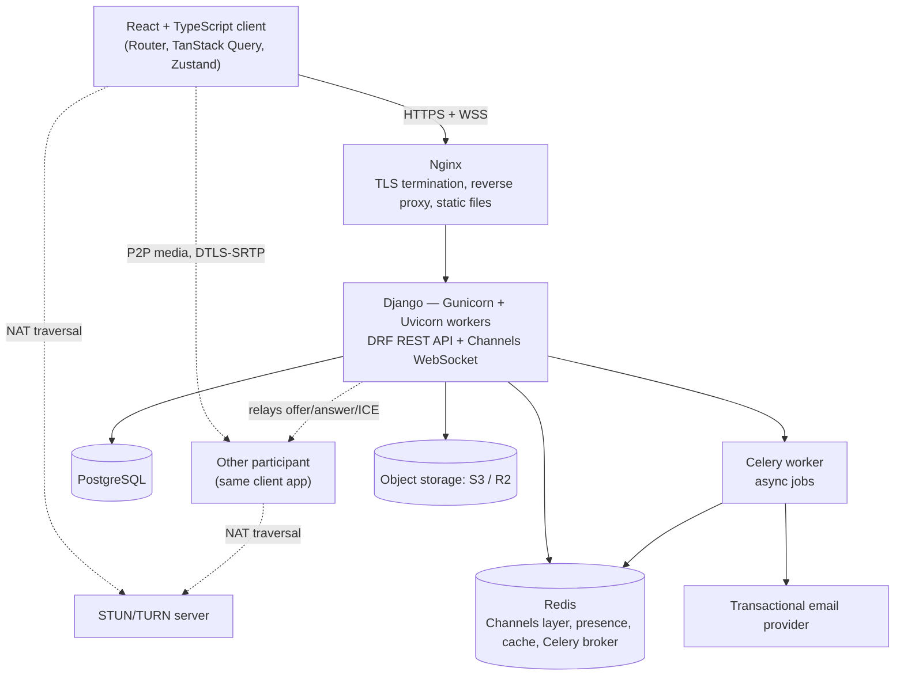

# SheyiHub — Phase 1: Requirements & Architecture

**Status:** Phase 1 — Planning & Design only. No implementation code included, per scope.
**Date:** July 2026
**Gate:** This phase is complete once you've reviewed §11–13. Phase 2 does not start automatically.

## Contents
1. [Business requirements](#1-business-requirements)
2. [Functional requirements](#2-functional-requirements)
3. [Non-functional requirements](#3-non-functional-requirements)
4. [User personas](#4-user-personas)
5. [User stories](#5-user-stories)
6. [Use cases](#6-use-cases)
7. [Edge cases](#7-edge-cases)
8. [System requirements](#8-system-requirements)
9. [High-level architecture overview](#9-high-level-architecture-overview)
10. [Technology justification](#10-technology-justification)
11. [Architectural decisions, explained](#11-architectural-decisions-explained)
12. [Assumptions](#12-assumptions)
13. [Risks](#13-risks)

---

## 1. Business requirements

**Vision:** a real-time communication and collaboration platform — video, voice, chat, file sharing, and a shared whiteboard — with an original design, built to the standard of a real production system rather than a class assignment.

**Primary goal:** demonstrate senior-level, full-stack engineering judgment for software engineering interviews. Architecture decisions, security awareness, and code quality carry more weight here than raw feature count.

**Success criteria for Phase 1:**
- Every feature in the brief is traceable to a requirement, a user story, and a place in the architecture.
- Every major technology choice has a stated reason.
- Assumptions and risks are explicit, not implied.

**In scope (overall project):** the full feature list below, delivered incrementally across phases.

**Out of scope (flagged now, not as a surprise later):** multi-tenant/org billing, formal compliance certifications (SOC 2, HIPAA), load-testing to thousands of concurrent users, native mobile apps. These are the specific things that separate marketing language like "enterprise-grade" from what one person can responsibly ship — more in §13.

**Stakeholders:** you, as developer and primary tester; eventual interviewers/reviewers as the audience the finished product has to convince.

## 2. Functional requirements

### Authentication
- FR1.1 Users can register with email + password
- FR1.2 Users can log in and log out
- FR1.3 Sessions use JWT access tokens with refresh tokens
- FR1.4 New accounts require email verification before full access (see §12)
- FR1.5 Users can request a password reset via email
- FR1.6 Users can edit their profile (name, avatar, status)

### Meetings
- FR2.1 Users can start an instant meeting
- FR2.2 Users can schedule a future meeting with date, time, and invitees
- FR2.3 Invited users receive a meeting invitation
- FR2.4 Meetings can enable a waiting room; the host admits or denies each participant
- FR2.5 Hosts have moderation controls (mute participant, remove participant, end meeting for all)
- FR2.6 Users can view a history of meetings they hosted or attended

### Video & audio
- FR3.1 Meetings support multiple simultaneous video participants
- FR3.2 Users can join audio-only
- FR3.3 Users can toggle camera and microphone independently
- FR3.4 Users can switch input devices without rejoining
- FR3.5 Participants display in a responsive grid
- FR3.6 The active speaker is visually indicated

### Screen sharing
- FR4.1 Users can share their full screen, a single window, or a browser tab
- FR4.2 Only one participant presents at a time; presenting can be handed off
- FR4.3 A clear on-screen indicator shows who is presenting

### Messaging
- FR5.1 Participants can send real-time text chat within a meeting
- FR5.2 Users can send direct messages to another user outside of meetings
- FR5.3 Users can participate in group chats outside of meetings
- FR5.4 Typing indicators show when another user is composing
- FR5.5 Messages show read receipts
- FR5.6 Users can react to messages with emoji

### Collaboration
- FR6.1 Meetings include a shared whiteboard participants can draw on together in real time
- FR6.2 The whiteboard supports freehand drawing, basic shapes, and sticky notes
- FR6.3 Whiteboard state persists and is available after the meeting ends

### Files
- FR7.1 Users can upload files within a meeting, including via drag-and-drop
- FR7.2 Users can download previously shared files
- FR7.3 Common file types (images, PDFs) show an inline preview

### Notifications
- FR8.1 Users receive in-app notifications for invites, reminders, and mentions
- FR8.2 Users can opt into browser notifications
- FR8.3 Users receive a reminder before a scheduled meeting starts

### Presence
- FR9.1 The system shows whether a user is online, away, or offline
- FR9.2 The system shows a user's last-seen time when offline
- FR9.3 Status changes reflect in real time without a page refresh

### Settings
- FR10.1 Users can switch between dark and light mode; the preference is remembered
- FR10.2 Users can configure notification preferences per category

## 3. Non-functional requirements

| Category | Requirement | Phase 1 target |
|---|---|---|
| Performance | P2P media latency | < 500ms end-to-end |
| Performance | REST API response time | < 300ms (p95) |
| Performance | Real-time event delivery (chat, presence, whiteboard) | < 200ms |
| Scalability | Participants per meeting (mesh WebRTC) | Up to 6 reliably (see §11) |
| Scalability | Backend processes | Horizontally scalable — Channels + Redis supports multiple workers |
| Reliability | WebSocket reconnect | Auto-retry within 5s, exponential backoff |
| Security | Transport encryption | TLS (HTTPS/WSS) everywhere; DTLS-SRTP for WebRTC media |
| Security | OWASP Top 10 | Parameterized ORM queries, CSRF protection, input validation/sanitization, rate limiting, dependency scanning in CI |
| Security | Credential storage | Hashed (Argon2/PBKDF2), never plaintext |
| Accessibility | WCAG | Target AA — keyboard navigation, semantic HTML, sufficient contrast, ARIA labels on custom controls (whiteboard, video grid) |
| Maintainability | Code quality | Linted, typed (TS strict + Python type hints), documented |
| Testing | Automated coverage | Unit tests for business logic; integration tests for API + WebSocket flows; component tests for critical UI |
| Browser support | Target browsers | Latest Chrome, Firefox, Edge; Safari supported with documented WebRTC caveats |

## 4. User personas

**Host** — runs recurring team meetings. Needs reliability and control more than novelty: who gets in, who can present. Frustrated by tools where "just start the meeting" takes five clicks. Leans on scheduling, waiting room, host controls, screen share.

**Participant** — joins meetings scheduled by others. Wants to get in fast, be seen and heard clearly, and find what was shared afterward. Frustrated by unclear permission prompts and chat history vanishing on reload. Leans on one-click join, chat, file sharing, meeting history.

**Everyday user** — uses the platform as an ongoing hub, not just for scheduled calls: DMs, group chats, presence, starting an ad hoc call from a conversation. Frustrated by tools that treat chat and calling as separate apps. Leans on presence, DMs/group chat, reactions, spontaneous calls.

## 5. User stories

*Format: As a [role], I want to [goal], so that [benefit]. Acceptance criteria noted where the story has real complexity.*

**Authentication**
- **US-01** As a new user, I want to register with email and password, so that I can create an account.
- **US-02** As a returning user, I want to log in securely, so that I can access my meetings. *AC: JWT issued on success; failed attempts rate-limited; unverified accounts are told why they can't proceed.*
- **US-03** As a user, I want to reset a forgotten password via email, so that I can regain access.
- **US-04** As a user, I want to edit my profile, so that I'm recognizable in meetings and chats.

**Meetings**
- **US-05** As a host, I want to start an instant meeting, so that I can begin collaborating immediately.
- **US-06** As a host, I want to schedule a meeting with invitees, so that people know when to join.
- **US-07** As a host, I want a waiting room, so that I control who enters. *AC: denied users see a clear message, not a silent hang.*
- **US-08** As a host, I want to mute or remove a participant, so that I can manage disruptions.
- **US-09** As a user, I want a list of past meetings, so that I can reference them later.

**Video & audio**
- **US-10** As a participant, I want to join via a link or code, so that I can enter without manual setup. *AC: camera/mic permission requested; if denied, user still joins in view/audio-only fallback.*
- **US-11** As a participant, I want to toggle my camera and mic, so that I control what I share.
- **US-12** As a participant, I want to switch devices mid-call, so that I don't have to rejoin if I change headsets.
- **US-13** As a participant, I want to see all participants in a grid with the active speaker highlighted, so that I can follow the conversation.

**Screen sharing**
- **US-14** As a participant, I want to share my screen or a window, so that others can see my content. *AC: one active presenter at a time; sharer can stop anytime; others see a clear "who's presenting" indicator.*
- **US-15** As a participant, I want to view a shared screen at a readable size, so that I can follow along.

**Messaging**
- **US-16** As a participant, I want to send chat during a meeting, so that I can communicate without interrupting audio.
- **US-17** As a user, I want to direct-message another user outside a meeting, so that I don't need to start a call for a quick question.
- **US-18** As a user, I want group chats outside of meetings, so that a team has one ongoing thread.
- **US-19** As a user, I want to see typing indicators and read receipts, so that conversations feel responsive.
- **US-20** As a user, I want to react to a message with an emoji, so that I can respond without typing.

**Collaboration**
- **US-21** As a participant, I want to draw on a shared whiteboard in real time, so that we can brainstorm visually. *AC: strokes sync within ~200ms; supports pen, shapes, text, eraser; state persists after the meeting ends.*
- **US-22** As a participant, I want to see who's currently drawing, so that I know who's contributing what.
- **US-23** As a host, I want to clear the whiteboard, so that I can reset it for a new topic.

**Files**
- **US-24** As a participant, I want to drag and drop a file into a meeting, so that others can access it. *AC: max size enforced client + server side; file-type allow-list; progress shown.*
- **US-25** As a participant, I want to download shared files after the meeting ends, so that I don't lose them.
- **US-26** As a participant, I want inline previews for images and PDFs, so that I don't have to download everything to check it.

**Notifications & presence**
- **US-27** As a user, I want a notification shortly before a meeting starts, so that I don't miss it.
- **US-28** As a user, I want to be notified when invited or mentioned, so that I stay informed.
- **US-29** As a user, I want to see who's online, so that I know if it's a good time to message or call them.

**Settings**
- **US-30** As a user, I want to toggle dark/light mode, with my preference remembered, so that the app is comfortable in any lighting.

## 6. Use cases

**UC-1 — Host schedules and runs a meeting with a waiting room**
Actor: Host. Precondition: logged in, email verified.
Main flow: host schedules a meeting with invitees → invitees get an invitation and later a reminder → at meeting time, host starts it → joining participants land in a waiting room → host admits or denies each one → admitted participants enter the live meeting.
Alternate flow: host denies a participant → that participant sees a clear "not admitted" message.
Postcondition: meeting is live; admitted participants have full access to video, chat, whiteboard, files.

**UC-2 — New user registers and verifies their account**
Actor: new user. Precondition: none.
Main flow: user submits registration → account created unverified → verification email sent → user clicks the link → account marked verified → user logs in.
Alternate flow: user tries to log in before verifying → system explains why and offers to resend the email.
Postcondition: user has a verified, usable account.

**UC-3 — Participant joins a live meeting and collaborates**
Actor: participant. Precondition: has an account and a valid invite/link.
Main flow: participant joins → admitted (or auto-admitted if no waiting room) → grants camera/mic permission → appears in the grid → sends chat → draws on the whiteboard.
Alternate flow: permission denied → joins in view/audio-only fallback instead of being blocked.
Postcondition: chat and whiteboard contributions are visible to all and persist after the meeting.

**UC-4 — User sends a direct message with a read receipt**
Actor: User A, User B. Precondition: both have accounts.
Main flow: A messages B → B is online, receives it in real time → B opens the conversation → A sees it marked read.
Alternate flow: B is offline → message delivers on next login; read receipt updates whenever B actually opens it.
Postcondition: B's last-read pointer for that conversation is updated.

**UC-5 — Presenter shares a screen and hands off to another participant**
Actor: Participant A (presenter), Participant B. Precondition: both in a live meeting.
Main flow: A shares → all see "A is presenting" and A's content → A stops → B starts → indicator updates to B.
Alternate flow: B tries to share while A is still presenting → held/denied until A stops.
Postcondition: exactly one presenter's content is visible at any time.

**UC-6 — User uploads and shares a file during a meeting**
Actor: participant. Precondition: in a live meeting.
Main flow: participant drags a file in → client validates type/size → uploads with progress shown → appears in the meeting's file list for everyone → others download or preview it.
Alternate flow: file exceeds the size limit → clear error before upload starts, not a failure after the fact.
Postcondition: file remains available in that meeting's history afterward.

## 7. Edge cases

**Network & connectivity**
- EC-01 Internet drops mid-call → attempt reconnect; notify other participants rather than silently dropping them
- EC-02 High latency/packet loss → show a connection-quality indicator instead of failing silently
- EC-03 Restrictive NAT/firewall → fall back to TURN relay when direct P2P fails
- EC-04 WebSocket disconnects → auto-reconnect with backoff, resync missed state

**Media & devices**
- EC-05 No camera/mic or permission denied → view/audio-only fallback rather than blocking entry
- EC-06 Device changes mid-call → detect the change, allow reselection without rejoining
- EC-07 Same user opens the meeting in two tabs → detect and handle as a duplicate session

**Concurrency**
- EC-08 Two users draw on the whiteboard at once → per-stroke conflict handling (last-write-wins, applied consistently)
- EC-09 Two participants try to screen-share at once → enforce the single-presenter rule
- EC-10 Two hosts schedule overlapping meetings → allowed, but surfaced clearly, not silently double-booked

**Messaging & presence**
- EC-11 User has multiple devices/tabs open → presence reads "online" if any session is active, doesn't flicker between them
- EC-12 Rapid duplicate reactions from one user → dedupe per user per message
- EC-13 A user wants read receipts off → open product decision, not assumed either way (see §12)
- EC-14 Long DM/group history → paginate rather than loading the full thread at once

**Scale**
- EC-15 Participant count exceeds mesh's practical ceiling (~6) → needs a defined behavior; SFU migration path in §11
- EC-16 Long meeting produces a large chat/whiteboard history → paginate

**Security**
- EC-17 Unauthorized user attempts to join a private meeting → server-side check on join, not just client-side gating
- EC-18 Meeting link/token shared beyond intended invitees → tokens should be revocable, not just a guessable slug
- EC-19 Malicious input in chat → sanitize/escape before render to prevent XSS
- EC-20 Malicious file upload → validate type and size server-side
- EC-21 Access token expires mid-session → silent refresh, not a forced logout mid-meeting
- EC-22 Unverified account tries to access core features → gated consistently server-side, not just hidden client-side

**Data**
- EC-23 Meeting scheduled across time zones → store UTC, render in each user's local time
- EC-24 Very large file upload → chunked upload or a hard size limit with a clear error
- EC-25 Host leaves without ending the meeting → migrate host permissions or auto-end after a timeout

**UX & platform**
- EC-26 Browser without WebRTC support → detect and show a clear unsupported-browser message
- EC-27 Mobile background-tab throttling → don't rely on in-tab timers alone for time-sensitive things like reminders
- EC-28 Browser notification permission denied → fall back to in-app only, don't nag repeatedly

## 8. System requirements

**Client-side**
- Supported browsers: latest Chrome, Firefox, Edge; Safari 16+ (WebRTC caveats documented separately)
- Permissions requested contextually, not all at once: camera, microphone, screen-share, browser notifications
- Planning baseline: ~1.5 Mbps up/down per active video stream for mesh calls at this scale

**Server-side**
- Containerized services (Docker) behind Nginx, Django served via Gunicorn with an ASGI worker class
- Persistent PostgreSQL and Redis instances
- A host capable of long-lived WebSocket connections — rules out pure serverless/request-response platforms

**Third-party dependencies (additions to the given stack — flagged, not silently assumed)**
- Transactional email provider — needed for verification, password reset, and reminders (e.g. SendGrid, Postmark, AWS SES)
- Object storage — S3-compatible, for uploaded files
- STUN/TURN — self-hosted (`coturn`) or managed, for NAT traversal

## 9. High-level architecture overview

**Flow, in short:** the client talks to Django two ways through Nginx — REST (via DRF) for anything CRUD-shaped, and one multiplexed WebSocket (via Channels) for everything real-time: signaling, chat, presence, whiteboard events, notifications. Once two peers exchange signaling over that socket, their audio/video/screen-share media flows **directly between browsers**, encrypted via DTLS-SRTP. Django never touches media — only the handshake that sets it up.

### Component responsibilities

| Component | Responsibility | Tech |
|---|---|---|
| Client | UI, routing, server-state caching, WebRTC peer connections | React, TypeScript, React Router, TanStack Query, Zustand |
| Edge | TLS termination, static files, reverse proxy (incl. WebSocket upgrade) | Nginx |
| App server | Auth, CRUD, business logic, real-time signaling/chat/presence/whiteboard sync | Django, DRF, Channels, Gunicorn/Uvicorn |
| Async worker | Deferred jobs — verification/reset/reminder emails, notification fan-out | Celery |
| Relational store | Users, meetings, messages, invites, file metadata | PostgreSQL |
| In-memory store | Channels layer backing, presence, cache, Celery broker | Redis |
| Object storage | Persisted file uploads | S3-compatible (R2/S3) |
| NAT traversal | Helps peers connect when direct P2P isn't possible | STUN/TURN |

### Data model (key entities)

| Entity | Key fields | Notes |
|---|---|---|
| **User** | id, email, password_hash, display_name, avatar_url, email_verified, theme_preference | — |
| **Meeting** | id, host_id, title, scheduled/actual start-end, status, room_slug, waiting_room_enabled | belongs to host |
| **MeetingParticipant** | id, meeting_id, user_id, role, status (waiting/admitted/denied), joined_at, left_at | joins Meeting ↔ User |
| **MeetingInvite** | id, meeting_id, invited_user_id, status | joins Meeting ↔ User |
| **Conversation** | id, type (meeting/dm/group), meeting_id (nullable) | unifies meeting chat, DMs, and group chats — one model, not three |
| **ConversationParticipant** | id, conversation_id, user_id, last_read_message_id | powers read receipts without a row per message per reader |
| **Message** | id, conversation_id, sender_id, content, sent_at | — |
| **MessageReaction** | id, message_id, user_id, emoji | — |
| **SharedFile** | id, conversation_id, uploader_id, filename, storage_url, content_type, size_bytes | — |
| **WhiteboardSnapshot** | id, meeting_id, canvas_data (JSON), updated_at | — |
| **Notification** | id, user_id, type, content, is_read, created_at | — |
| **NotificationPreference** | id, user_id, category, in_app_enabled, browser_enabled | — |
| **UserPresence** | user_id, status, last_seen | Redis, not Postgres — this is ephemeral, high-churn state |

### Real-time communication design

One WebSocket per client at `/ws/user/{id}/`, multiplexed by a `type` field (`offer`, `answer`, `ice-candidate`, `chat-message`, `whiteboard-event`, `presence-update`, `notification`) rather than a socket per feature.

**WebRTC signaling flow (mesh, per new participant):**
1. Client authenticates, opens the WebSocket; Channels adds it to a group scoped to the meeting.
2. Server broadcasts `user-joined` to the group.
3. Each existing participant creates an `RTCPeerConnection`, generates an SDP offer, sends it over the socket.
4. Channels relays the offer to the new participant.
5. New participant creates its own `RTCPeerConnection`, sets the remote offer, sends back an answer.
6. Both sides exchange ICE candidates as discovered, relayed the same way.
7. Once ICE negotiation completes, media flows directly between browsers (or via TURN) — independent of Django from that point on.
8. On disconnect, server broadcasts `user-left` so peers tear down the corresponding connection.

### Video/media scaling strategy — the decision that matters most

Pure mesh (every participant connects directly to every other participant) is the simplest thing to build and is genuinely multi-user — but bandwidth and CPU cost grow with the *square* of headcount, since each participant uploads a separate stream to every other participant. In practice it holds up well to **4–6 participants**; past that, quality degrades fast. That's a real gap against "comparable to Teams/Zoom," which use an **SFU (Selective Forwarding Unit)** — each client uploads once, the server fans it out. Building one from scratch is a project in itself; the realistic path is integrating an existing one (LiveKit ships a full server + SDKs; mediasoup is a lower-level toolkit if you want to demonstrate deeper protocol understanding). Either runs as its own service alongside Django, since both are Node.js/Go rather than Python.

**Recommendation:** build on mesh first. It's real, it's multi-user, and it lets the whole feature set ship without SFU complexity blocking everything else. Keep the transport (mesh vs. SFU) swappable behind the signaling layer, and treat SFU integration as a clearly-scoped later phase. Knowing *why and when* you'd move off mesh is a better interview story than mesh vs. SFU being invisible in the design.

### Security architecture

- **Auth:** JWT access token (short-lived) + refresh token (longer-lived, `httpOnly` cookie recommended to reduce XSS exposure), e.g. via `djangorestframework-simplejwt`.
- **Transport:** TLS for HTTPS/WSS everywhere; DTLS-SRTP for WebRTC media — mandatory in the spec, not optional.
- **At rest:** passwords hashed (Argon2/PBKDF2); files in object storage with server-side encryption enabled.
- **OWASP Top 10, concretely:** Django ORM's parameterized queries (injection), DRF's CSRF/session handling, input sanitization on chat/filenames (XSS), rate limiting on auth endpoints (brute force), `pip-audit`/`npm audit` in CI (vulnerable dependencies).
- **Authorization (RBAC):**

| Action | Host | Participant |
|---|---|---|
| Start/end meeting | ✅ | ❌ |
| Admit/deny in waiting room | ✅ | ❌ |
| Mute/remove a participant | ✅ | ❌ |
| Screen share | ✅ | ✅ (if not already in use) |
| Chat, file upload, whiteboard edit | ✅ | ✅ |
| Clear whiteboard | ✅ | ❌ |
| Schedule/edit/cancel meeting | ✅ | ❌ |

### Deployment architecture

**Services (Docker Compose locally, Railway in production):**

| Service | Purpose |
|---|---|
| `frontend` | Vite build, served statically |
| `backend` | Django via Gunicorn + Uvicorn worker class, serving REST and WebSocket behind Nginx |
| `postgres` | Primary database |
| `redis` | Channels layer, cache, Celery broker |
| `celery-worker` | Background jobs — email, reminders, notification fan-out |
| `coturn` *(or a managed TURN provider — see §12)* | NAT traversal for WebRTC |

**CI/CD (GitHub Actions):** lint (ESLint/Prettier, Ruff/Black) → type-check (`tsc --noEmit`, `mypy`) → test (Jest/RTL, pytest) → dependency audit → build images → deploy to Railway.

## 10. Technology justification

| Layer | Technology | Why | Alternative considered |
|---|---|---|---|
| Frontend | React | Component model, huge ecosystem, matches existing experience | Vue/Svelte — smaller ecosystem at this scope |
| Frontend | TypeScript | Type safety across a large, multi-domain codebase (signaling, chat, whiteboard state) | Plain JS — higher risk at this scale |
| Frontend | Vite | Fast dev server/HMR, modern build tooling | Webpack — slower iteration |
| Frontend | Tailwind CSS | Utility-first; fast to build a consistent, *original* design without fighting a component library's defaults | MUI/Chakra — faster start, harder to make original |
| Frontend | React Router | Standard client-side routing for a multi-view SPA | TanStack Router — newer, smaller ecosystem |
| Frontend | TanStack Query | Caching/sync for server state (meetings, history, files) with built-in retries/invalidation | Manual `useEffect`+fetch — more boilerplate, more bugs |
| Frontend | Zustand | Minimal client state for ephemeral UI/call state, cleanly separated from server state | Redux Toolkit — more ceremony for this scope |
| Backend | Django | Batteries-included (auth, ORM, admin) — fast to build a large domain model correctly | FastAPI — less built-in, more assembly |
| Backend | DRF | Mature REST layer on top of Django's ORM/auth | Hand-rolled views — more boilerplate |
| Backend | Django Channels | Standard way to add WebSocket/ASGI support without leaving the framework | Separate Node.js real-time service — a second language/runtime to operate |
| Database | PostgreSQL | Relational integrity for meetings/users/messages/invites; strong JSON support where needed | MongoDB — weaker relational guarantees for this data shape |
| Real-time | Redis | Required by Channels for multi-process pub/sub; doubles as presence store, cache, Celery broker | — effectively a requirement, not a choice |
| Real-time | WebRTC | Browser-native standard for P2P audio/video/screen-share, encrypted by default | None credible for browser-based real-time media |
| Real-time | WebSockets (Channels) | Persistent bidirectional channel for signaling, chat, presence, whiteboard | Polling — higher latency, more server load |
| Deployment | Docker/Compose | Consistent environments dev→prod, matches how services actually run together | Bare-metal setup — harder to reproduce |
| Deployment | Gunicorn + Uvicorn workers | Mature process management (worker recycling, graceful reload) with ASGI support for Channels | Daphne alone — fewer production-hardening features |
| Deployment | Nginx | TLS termination, static files, reverse proxy with WebSocket upgrade in front of Gunicorn | Exposing Gunicorn directly — no static-file offload, weaker hardening |
| Deployment | GitHub Actions | CI/CD tied directly to the repo, free for this use | Jenkins — more ops overhead, no added benefit here |
| Deployment | Railway | Simple deploys, supports long-running ASGI processes (required for WebSockets) | Raw AWS — more control, much more setup |

## 11. Architectural decisions, explained

1. **Mesh WebRTC now, SFU-ready later.** The single biggest scope/scale decision — see §9. Keeps v1 shippable without taking on SFU complexity before the rest of the app exists.
2. **One `Conversation`/`Message` model for meeting chat, DMs, and group chat.** Rather than three separate chat systems, everything that's "a thread someone can post in" shares one schema — a direct application of DRY, and it means chat features (reactions, read receipts, typing indicators) are built once, not three times.
3. **One multiplexed WebSocket per user, not one per feature.** Signaling, chat, presence, whiteboard, and notifications all ride the same connection with a `type` field. Simpler to reason about, fewer moving parts to keep in sync — KISS over a "cleaner-looking" but more complex multi-socket design.
4. **REST for CRUD, WebSocket for everything real-time.** A clean separation of concerns: anything that's "fetch or change a record" goes through DRF; anything that's "notify people right now" goes through Channels. Neither layer has to do the other's job.
5. **Redis as the shared backbone.** One piece of infrastructure serving the Channels layer, presence, caching, and the Celery broker — fewer services to operate, at the cost of one component doing several jobs (mitigated by separate Redis logical DBs/key namespaces per use).
6. **Celery for anything that can wait.** Email and notification fan-out move off the request/response and WebSocket paths, so a slow email provider never becomes a slow chat message.
7. **Nginx + Gunicorn/Uvicorn + Docker as the production-hardening layer.** Each piece has one job — TLS/static/proxy, process management, ASGI execution — rather than Django serving everything directly, which is the standard shape of a real deployment, not just a demo one.

## 12. Assumptions

- **Team size:** solo build. Adjust phase pacing if this becomes a team effort.
- **Access model:** all core features assume authenticated, verified users — no anonymous guest-link join in v1.
- **Read receipts:** on by default for all conversations in v1, with no per-user opt-out yet (flagged in EC-13 as an open product question).
- **Hosting:** Railway hosts both frontend and backend, per the stated stack.
- **Stack is fixed as given**, with three explicit additions called out wherever they appear rather than assumed silently: transactional email provider, object storage, and STUN/TURN.
- **Mesh participant cap (~6)** is an acceptable v1 limit, with the SFU migration path in §9/§11 as the documented growth story.

## 13. Risks

1. **Scope risk — the big one.** Ten feature categories, roughly 45 individual features, plus "enterprise-grade, comparable to Teams + Meet + Zoom + Discord" framing, is a multi-person, multi-month undertaking if taken literally. As a solo project, this risks stalling or shipping shallow/broken versions of many things rather than a smaller set done well. **Mitigation:** phase the *build* the same way this planning is phased — a focused, fully-polished core (auth, video/audio, chat, screen share) before layering on DMs, whiteboard, waiting room, reactions, and the rest. What actually reads as senior in an interview is depth and judgment on a real system, not a checklist of matched features.
2. **WebRTC scaling risk.** Mesh caps around 6 participants; if a demo needs to visibly show "Zoom-scale," it will fail without an SFU, which is a substantial additional build (§9).
3. **Real-time complexity risk.** Presence, read receipts, typing indicators, and whiteboard sync are individually simple but combinatorially complex once they all share one socket and one Redis layer under load. Reconnection and race-condition edge cases (§7) are easy to underestimate.
4. **Third-party dependency risk.** TURN relay and transactional email aren't in the original stack list; without them, calls fail behind restrictive NATs and verification/reset/reminder emails never arrive. Both are called out now specifically so they aren't discovered late.
5. **Quality-bar discipline risk.** OWASP Top 10, WCAG, and automated testing are ongoing disciplines, not a checklist done once at the end. Realistic risk of being deprioritized under feature-delivery pressure — worth deciding now that they're non-negotiable per PR, not a cleanup pass later.
6. **"Enterprise-grade" as literal marketing language.** The Django/Channels/Redis layer genuinely does scale horizontally (§3), so that part of the claim holds up. The media path (mesh) and the absence of things like multi-region deployment or load-testing don't, yet — true enterprise-grade is a different, larger project than a portfolio piece. Framing this honestly (a well-architected system that *knows* its current limits and *shows* a real path past them) is a stronger interview story than overclaiming.
