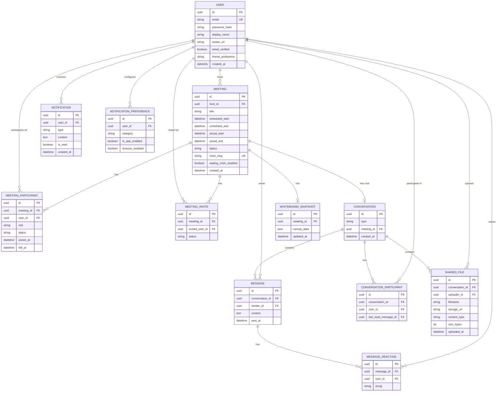
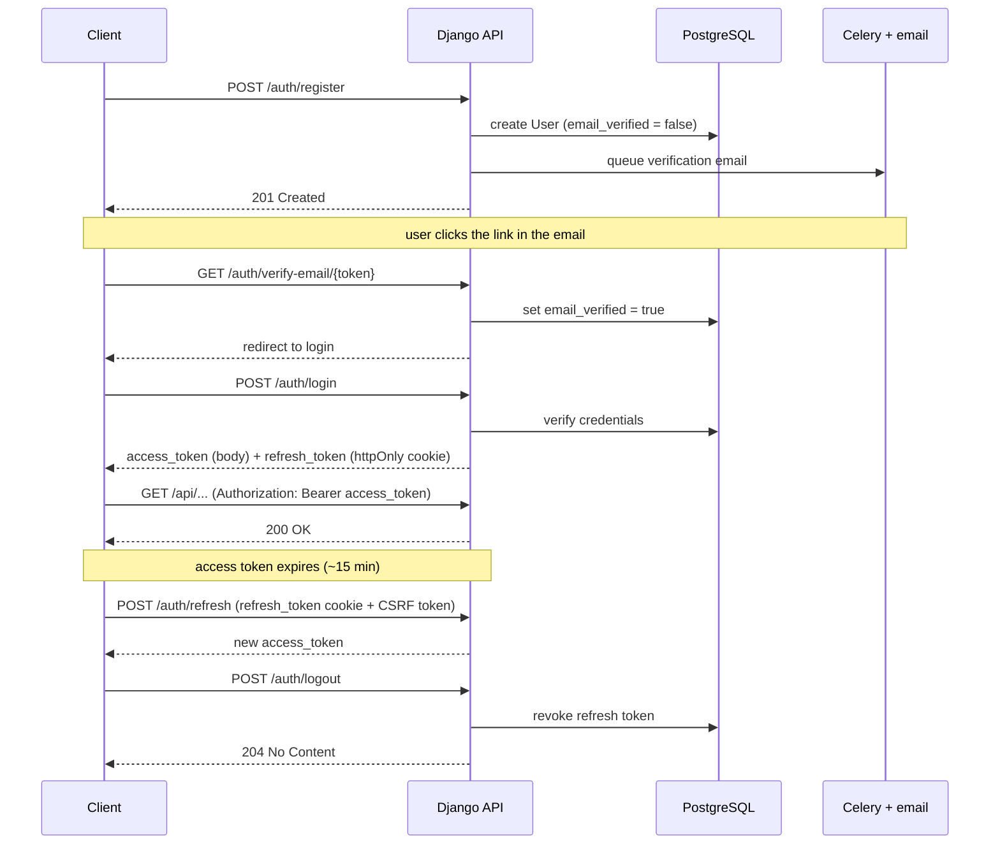
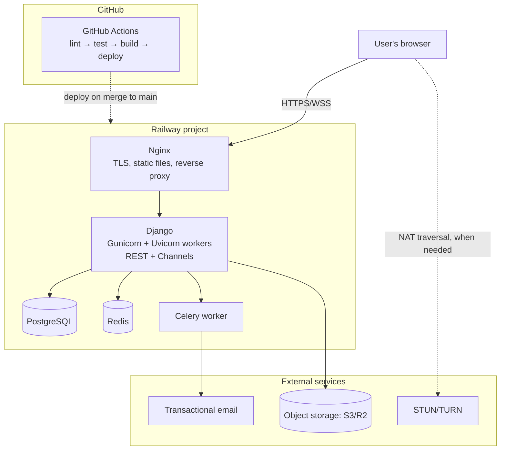

# SheyiHub — Phase 2: System Architecture

**Status:** Phase 2 — detailed system design. No implementation code, per scope.
**Builds on:** `SheyiHub_Phase1_Requirements_Architecture.md` — this doc doesn't re-justify decisions already made there (mesh vs. SFU, tech choices, high-level component responsibilities); it operationalizes them.

## Contents
1. [Folder structure](#1-folder-structure)
2. [Database ERD](#2-database-erd)
3. [API specification](#3-api-specification)
4. [Authentication flow](#4-authentication-flow)
5. [Authorization model](#5-authorization-model)
6. [WebSocket event model](#6-websocket-event-model)
7. [Component hierarchy](#7-component-hierarchy)
8. [Deployment diagram](#8-deployment-diagram)
9. [Key decisions in this phase](#9-key-decisions-in-this-phase)

---

## 1. Folder structure

**Repo layout** — one repo, frontend and backend as siblings:

```
sheyihub/
├── frontend/
├── backend/
├── docs/                        # Phase 1 & 2 docs live here
├── docker-compose.yml
├── docker-compose.prod.yml
├── .github/
│   └── workflows/
│       ├── ci.yml
│       └── deploy.yml
└── README.md
```

**Frontend** — feature-based, not type-based (a `meetings/` folder holds its own components + hooks + API calls, rather than one giant `components/` folder for everything):

```
frontend/
├── src/
│   ├── app/                     # providers, router, app shell
│   │   ├── providers.tsx
│   │   └── router.tsx
│   ├── features/
│   │   ├── auth/
│   │   ├── meetings/
│   │   ├── video/
│   │   ├── messaging/
│   │   ├── whiteboard/
│   │   ├── files/
│   │   ├── notifications/
│   │   └── settings/
│   │       # each feature: components/, hooks/, api.ts, types.ts
│   ├── components/               # shared, presentational only
│   ├── hooks/                    # shared hooks (useWebSocket, useTheme)
│   ├── lib/                      # api client, ws client, query client, utils
│   ├── stores/                   # Zustand stores (callStore, uiStore)
│   ├── types/                    # shared TS types
│   ├── styles/
│   ├── App.tsx
│   └── main.tsx
├── public/
├── index.html
├── vite.config.ts
├── tailwind.config.js
├── tsconfig.json
└── package.json
```

**Backend** — one Django app per domain, mirroring the frontend's feature split:

```
backend/
├── config/
│   ├── settings/
│   │   ├── base.py
│   │   ├── development.py
│   │   └── production.py
│   ├── asgi.py                  # Channels entry point
│   ├── wsgi.py
│   ├── celery.py
│   └── urls.py
├── apps/
│   ├── users/                   # User model, profile, auth views/serializers
│   │   ├── models.py
│   │   ├── serializers.py
│   │   ├── views.py
│   │   ├── permissions.py
│   │   ├── urls.py
│   │   └── tests/
│   ├── meetings/                # Meeting, MeetingParticipant, MeetingInvite
│   ├── messaging/                # Conversation, Message, MessageReaction
│   ├── whiteboard/                # WhiteboardSnapshot
│   ├── files/                     # SharedFile
│   ├── notifications/            # Notification, NotificationPreference, tasks.py
│   └── realtime/                  # Channels routing + consumers, shared by all apps
│       ├── consumers.py
│       ├── routing.py
│       └── groups.py
├── core/                          # base classes, shared exceptions, shared permissions
├── requirements/
│   ├── base.txt
│   ├── development.txt
│   └── production.txt
├── manage.py
└── Dockerfile
```

## 2. Database ERD



Notes: all primary keys are UUIDs, not auto-increment integers (see §9). `CONVERSATION` unifies meeting chat, DMs, and group chats — `meeting_id` is populated only for the "meeting" type. Presence (`UserPresence`) is intentionally absent here — it's Redis-backed, ephemeral, high-churn state, not a relational table (Phase 1 §9).

## 3. API specification

All endpoints are under `/api/`. "Verified" means authenticated **and** `email_verified = true`.

| Method | Endpoint | Purpose | Auth |
|---|---|---|---|
| POST | `/auth/register` | Create account (unverified) | Public |
| POST | `/auth/login` | Obtain access + refresh token | Public |
| POST | `/auth/refresh` | Exchange refresh cookie for a new access token | Refresh cookie |
| POST | `/auth/logout` | Revoke refresh token | Authenticated |
| GET | `/auth/verify-email/{token}` | Verify email address | Public (token) |
| POST | `/auth/resend-verification` | Resend verification email | Authenticated |
| POST | `/auth/password-reset/request` | Send reset email | Public |
| POST | `/auth/password-reset/confirm` | Set new password | Public (token) |
| GET | `/users/me` | Current user's profile | Authenticated |
| PATCH | `/users/me` | Update profile, theme preference | Authenticated |
| GET | `/users/{id}` | Public profile (display name, avatar, presence) | Authenticated |
| POST | `/meetings` | Create instant or scheduled meeting | Verified |
| GET | `/meetings` | List meetings (upcoming / history, filterable) | Authenticated |
| GET | `/meetings/{id}` | Meeting detail | Participant or invitee |
| PATCH | `/meetings/{id}` | Edit scheduled meeting | Host |
| DELETE | `/meetings/{id}` | Cancel meeting | Host |
| POST | `/meetings/{id}/join` | Request to join (returns waiting/admitted) | Verified |
| POST | `/meetings/{id}/participants/{user_id}/admit` | Admit from waiting room | Host |
| POST | `/meetings/{id}/participants/{user_id}/deny` | Deny from waiting room | Host |
| POST | `/meetings/{id}/participants/{user_id}/remove` | Remove participant | Host |
| POST | `/meetings/{id}/invites` | Invite users | Host |
| GET | `/meetings/{id}/whiteboard` | Get latest whiteboard snapshot | Participant |
| PUT | `/meetings/{id}/whiteboard` | Save snapshot | Participant |
| DELETE | `/meetings/{id}/whiteboard` | Clear whiteboard | Host |
| GET | `/conversations` | List DMs/group chats | Authenticated |
| POST | `/conversations` | Start a DM or group chat | Verified |
| GET | `/conversations/{id}/messages` | Paginated message history | Conversation participant |
| POST | `/conversations/{id}/messages` | Send message (REST fallback; primary path is WS) | Conversation participant |
| POST | `/messages/{id}/reactions` | Add reaction | Conversation participant |
| DELETE | `/messages/{id}/reactions/{emoji}` | Remove own reaction | Reaction owner |
| POST | `/conversations/{id}/files` | Upload file | Conversation participant |
| GET | `/conversations/{id}/files` | List files | Conversation participant |
| GET | `/files/{id}/download` | Signed download URL | Conversation participant |
| GET | `/notifications` | List notifications | Authenticated |
| POST | `/notifications/{id}/read` | Mark as read | Notification owner |
| GET | `/notifications/preferences` | Get preferences | Authenticated |
| PATCH | `/notifications/preferences` | Update preferences | Authenticated |

## 4. Authentication flow



A user can register and log in before verifying — the access token is issued either way. What changes is what the token is *allowed to do*: endpoints gated by "Verified" in §3 check `email_verified` server-side and return a 403 with a clear reason (EC-22 from Phase 1), rather than blocking login entirely.

## 5. Authorization model

Meeting-level roles (Host/Participant) are as defined in Phase 1 §9 and unchanged here. What's new:

**Conversation-scoped rules**

| Action | Rule |
|---|---|
| Read/send messages | Must be a `ConversationParticipant` |
| Add/remove a reaction | Must be a participant; can only remove your own |
| Upload/download files | Must be a participant |
| Start a DM or group | Any verified user (creates the conversation and adds participants) |

**Ownership rules**

| Resource | Rule |
|---|---|
| User profile | Only the user themself can edit it |
| Notification | Only the owning user can mark it read |
| Meeting (edit/cancel) | Only the host |
| Message reaction | Only the reacting user can remove it |

**DRF permission classes** (named here as design; implemented in a later phase): `IsAuthenticated` (baseline), `IsEmailVerified` (gates meeting/messaging/file actions), `IsMeetingHost`, `IsMeetingParticipantOrHost`, `IsConversationParticipant`, `IsOwner` (profile, notifications, own reactions).

## 6. WebSocket event model

Channel design shown above: each client opens one WebSocket and is subscribed to a personal `user.{id}` channel for the whole session, and joins a `meeting.{id}` channel only while actually in a live call. Every message carries a `type` field so both channels share one connection (Phase 1 §11).

| Event type | Direction | Channel | Payload (key fields) | Purpose |
|---|---|---|---|---|
| `user-joined` / `user-left` | S→C (broadcast) | meeting | user_id, display_name | Presence within a call |
| `offer` / `answer` | C→S→C (relayed) | meeting | target_user_id, sdp | WebRTC signaling |
| `ice-candidate` | C→S→C (relayed) | meeting | target_user_id, candidate | WebRTC signaling |
| `whiteboard-event` | C→S→C (broadcast) | meeting | meeting_id, stroke_data | Real-time drawing sync |
| `waiting-room-update` | S→C | meeting | meeting_id, status | Admit/deny result |
| `chat-message` | C→S→C (broadcast) | meeting or user | conversation_id, content | Chat delivery (meeting chat rides the meeting channel; DMs/groups ride the recipients' user channels) |
| `typing` | C→S→C (broadcast) | meeting or user | conversation_id, is_typing | Typing indicator |
| `message-read` | C→S→C (broadcast) | meeting or user | conversation_id, last_read_message_id | Read receipt |
| `reaction-added` | C→S→C (broadcast) | meeting or user | message_id, emoji | Live reaction |
| `presence-update` | S→C (broadcast) | user | user_id, status | Online/away/offline, outside a call |
| `notification` | S→C | user | type, content | Invite, mention, reminder |
| `error` | S→C | either | code, message | Structured error over WS |

## 7. Component hierarchy

```
App
├── Providers (QueryClientProvider, AuthProvider, ThemeProvider)
├── Router
│   ├── Public routes
│   │   ├── LoginPage
│   │   ├── RegisterPage
│   │   ├── VerifyEmailPage
│   │   └── ResetPasswordPage
│   └── Protected routes (require auth + verified)
│       ├── DashboardLayout
│       │   ├── Sidebar (Meetings, Chats, Notifications, Settings)
│       │   └── TopBar (presence, theme toggle, notification bell)
│       ├── MeetingsListPage → MeetingCard[]
│       ├── ScheduleMeetingPage → MeetingForm
│       ├── MeetingRoomPage
│       │   ├── VideoGrid → ParticipantTile[]
│       │   ├── ControlBar (mute, camera, share, leave)
│       │   ├── ChatPanel → MessageList, MessageInput
│       │   ├── WhiteboardPanel → WhiteboardCanvas, ToolBar
│       │   ├── FileSharePanel → FileList, FileUploadDropzone
│       │   └── WaitingRoomModal (host only)
│       ├── ConversationsPage
│       │   ├── ConversationList → ConversationListItem[]
│       │   └── ConversationView → MessageList, MessageInput, TypingIndicator
│       ├── MeetingHistoryPage → HistoryDetail
│       └── SettingsPage → ProfileForm, ThemeToggle, NotificationPreferences
```

## 8. Deployment diagram



P2P media (browser-to-browser) is deliberately not shown here — it never touches this infrastructure (Phase 1 §9).

## 9. Key decisions in this phase

1. **UUID primary keys + a separate short `room_slug`.** Internal IDs never appear in URLs; a meeting's join link uses its own revocable, URL-safe slug — directly closes Phase 1's EC-18 (leaked links should be revocable, not just a guessable ID).
2. **Access token in memory, refresh token in an httpOnly cookie.** Splits token exposure: a successful XSS can steal the short-lived access token but not the refresh token, limiting the blast radius.
3. **Two WebSocket channels per connection, not one per feature.** Makes Phase 1's "one multiplexed socket" decision concrete: presence, DMs, and notifications always reach you; call-specific events only reach you while you're actually in that call.
4. **Meeting chat persists as ordinary `Message` rows against the meeting's `Conversation`.** Meeting history and DM history are read through the same code path, not two — reinforces the DRY decision from Phase 1 §11.
5. **Django apps and React features are both organized by domain, not by technical layer.** `apps/meetings/` owns its own models, views, and serializers; `features/meetings/` owns its own components, hooks, and API calls. Same principle applied on both ends of the stack.
